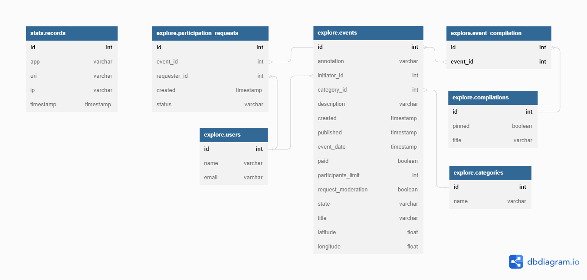

# Java Explore with me.
ExploreWithMe project.  
PR link: https://github.com/MadeOfSt0ne/java-explore-with-me/pull/1  
1. Инструкция по запуску  
* Для тестов обоих сервисов используется база данных H2, её настройки хранятся в папке /test/resources  
Можно запускать тесты по одному, можно весь тестовый класс, можно "Run All Tests"
* Команда "docker-compose up" запускает оба сервиса с их бд
* Чтобы запустить сервисы по отдельности (через main) нужна запущенная бд Postgres. С помощью 
pgAdmin4 создайте новую бд и внесите её название, имя пользователя и пароль в настройки /main/resources
2. Спецификации. Для чтения используйте [Swagger](https://editor-next.swagger.io).  
* [Основной сервис](https://github.com/MadeOfSt0ne/java-explore-with-me/blob/develop/ewm-main-service-spec.json)
* [Сервис статистики](https://github.com/MadeOfSt0ne/java-explore-with-me/blob/develop/ewm-stats-service-spec.json)  
3. Технологии  
Java 11, Springboot, Maven, Hibernate, JUnit, PostgreSQL, QueryDsl, Lombok, RestTemplate

  
4. Схема баз данных

5. Описание проекта  
   Приложение представляет собой афишу, где можно предложить какое-либо событие от выставки до похода в кино и набрать
   компанию для участия в нём. Приложение состоит из двух сервисов.
   Основной сервис — содержит всё необходимое для работы продукта.
   Сервис статистики — хранит количество просмотров и позволяет делать различные выборки для анализа работы приложения.  
   * Основной сервис  
   API основного сервиса состоит из трех частей:   
   1. Первая — публичная, доступна без регистрации любому пользователю сети.  
      Публичный API предоставляет возможности поиска и фильтрации событий.  
      Сортировка списка событий организована либо по количеству просмотров, которое запрашивается в 
      сервисе статистики, либо по датам событий.  
      При просмотре списка событий возвращается только краткая информация о мероприятиях.  
      Настроена возможность получения всех имеющихся категорий и подборок событий (такие подборки будут составлять администраторы ресурса).  
      Каждый публичный запрос для получения списка событий или полной информации о мероприятии фиксируется сервисом статистики.
   2. Вторая — закрытая, доступна только авторизованным пользователям.  
      Закрытая часть API реализовывает возможности зарегистрированных пользователей продукта.  
      Авторизованные пользователи имеют возможность добавлять в приложение новые мероприятия, редактировать их и
      просматривать после добавления.  
      Настроена подача заявок на участие в интересующих мероприятиях.  
      Создатель мероприятия имеет возможность подтверждать заявки, которые отправили другие пользователи сервиса.
   3. Третья — административная, для администраторов сервиса.   
      Административная часть API предоставляет возможности настройки и поддержки работы сервиса.  
      Настроено добавление, изменение и удаление категорий для событий.  
      Есть возможность добавлять, удалять и закреплять на главной странице подборки мероприятий.  
      Реализована модерация событий, размещённых пользователями, — публикация или отклонение.  
      Настроено управление пользователями — добавление, просмотр и удаление.
   * Сервис статистики  
     Второй сервис, статистики, призван собирать информацию.   
     Во-первых, о количестве обращений пользователей к спискам событий и, во-вторых, о количестве запросов к подробной
     информации о событии. На основе этой информации должна формироваться статистика о работе приложения.  
     Функционал сервиса статистики:  
     запись информации о том, что был обработан запрос к эндпоинту API  
     предоставление статистики за выбранные даты по выбранному эндпоинту.
   * Аутентификация и авторизация  
     Оба сервиса ExploreWithMe работают за VPN. С внешним миром их связывает гейтвей. Он контактирует с системой 
     аутентификации и авторизации, а затем перенаправляет запрос в сервисы. То есть, если гейтвей пропустил запрос к
     закрытой или административной части API, значит этот запрос успешно прошел аутентификацию и авторизацию.

